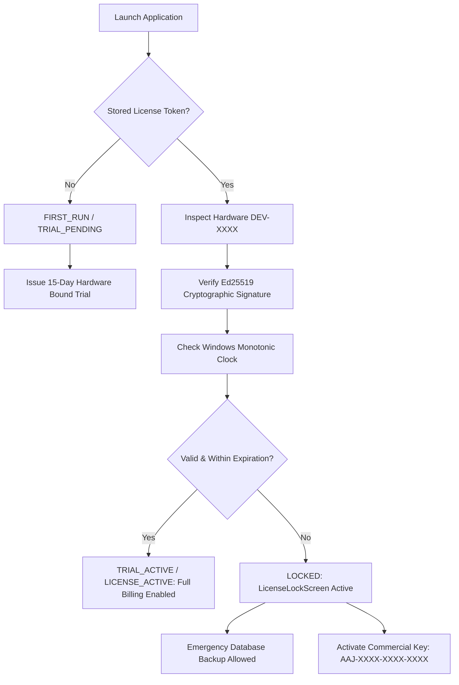

# Aaj Cash & Carry POS (آج کیش اینڈ کیری)

> **Offline-First Desktop POS, Inventory Management & Digital Khata for Pakistani Retailers, Cash & Carry, General Stores, and Marts.**

[](https://github.com/TOSEEF0/pos_system)
[](https://www.electronjs.org/)
[](https://react.dev/)
[](https://www.sqlite.org/)
[](https://github.com/TOSEEF0/pos_system)

---

## 📋 Table of Contents

1. [Overview](#-overview)
2. [Key Features](#-key-features)
   - [POS Billing & Barcode Scanning](#1-pos-billing--barcode-scanning)
   - [Loose Goods & Weight System (Kg, Grams, Litres)](#2-loose-goods--weight-system-kg-grams-litres)
   - [Digital Khata / Udhaar Management](#3-digital-khata--udhaar-management)
   - [Profit Realization Accounting](#4-profit-realization-accounting)
   - [Inventory & Category Management](#5-inventory--category-management)
   - [Purchases & Vendor Ledgers](#6-purchases--vendor-ledgers)
   - [Thermal Receipt Printing](#7-thermal-receipt-printing)
   - [Security & Password Recovery](#8-security--password-recovery)
   - [Audit Logs](#9-audit-logs)
   - [Guaranteed Offline Database & Backup](#10-guaranteed-offline-database--backup)
3. [Cryptographic Licensing System (15-Day Trial & Commercial)](#-cryptographic-licensing-system)
4. [Default Credentials](#-default-credentials)
5. [Buyer Setup & Deployment Guide](#-buyer-setup--deployment-guide)
6. [Developer & Build Guide](#-developer--build-guide)
7. [Licensing Server & Key Generation](#-licensing-server--key-generation)
8. [License](#-license)

---

## 🌟 Overview

**Aaj Cash & Carry POS** is a high-performance, offline-first Windows desktop application tailored specifically for retail cash & carry stores, grocery shops, marts, wholesale counters, cosmetics stores, and general merchants in Pakistan.

### Core Philosophy: 100% Offline-First
Normal business operations **never depend on active internet connectivity**. Billing, barcode scanning, inventory deduction, credit khata, profit calculations, and receipt printing function entirely on the local computer with zero latency using an embedded SQLite database in WAL (Write-Ahead Logging) mode.

---

## 🚀 Key Features

### 1. POS Billing & Barcode Scanning
- **High-Speed Checkout:** Supports standard USB barcode scanners with instantaneous item entry and keyboard navigation.
- **Search Autocomplete:** Real-time search by product name or barcode.
- **Discounts & Custom Notes:** Apply percentage discounts per transaction and attach customer notes.
- **Multiple Payment Types:** Cash, Debit/Credit Card, and Customer Udhaar (Credit).
- **Cash Change Calculator:** Automatic calculation of customer balance/change on cash tenders.

### 2. Loose Goods & Weight System (Kg, Grams, Litres)
Designed specifically for local grocery needs (Sugar, Flour, Rice, Pulses, Cooking Oil, Spices):
- **Dynamic Units of Measure:** Support for `Pieces (pcs)`, `Kilograms (kg)`, `Grams (g)`, `Litres (ltr)`, and `Pack`.
- **Bidirectional Weight $\leftrightarrow$ Cash Calculation:**
  - **Weight-First:** Entering `0.5 kg` Sugar @ Rs. 150/kg automatically computes **Rs. 75.00**.
  - **Decimal Precision:** Supports granular decimal entries (e.g. `3.5 kg` Flour @ Rs. 120/kg = **Rs. 420.00**).
  - **Cash-Amount-First:** When a customer asks for *"Rs. 100 ki Daal"* @ Rs. 300/kg, typing `100` into the Amount field automatically computes **0.333 kg (333 grams)** and locks the line total to exactly Rs. 100.00.
- **1-Click Preset Weight Chips:** Quick counter buttons (`250g / 1 Pao`, `500g / Aadha Kilo`, `1kg`, `2kg`) and step buttons (`-0.5` / `+0.5`) for fast counter operation.
- **Inventory Deduction:** Stock deducted with 3-decimal-place precision (`ROUND(quantity - ?, 3)`).

### 3. Digital Khata / Udhaar Management
- **Immutable Double-Entry Ledger:** Every debit (credit sale) and credit (customer cash recovery) is recorded with timestamp, reference invoice, cashier name, and running balance.
- **Customer Directory:** Quick search by customer name or phone number.
- **Credit Limits:** Set maximum credit threshold with configurable shop policy (Warning or Hard Block).
- **Partial Payments:** Accept installment payments against customer balance and print payment receipts.
- **WhatsApp Customer Statement:** 1-click sharing of detailed account balance statements directly via WhatsApp.
- **Safe Sale Deletion:** Deleting an Udhaar sale automatically restores stock, cleans up the invoice debit, and reverses upfront payments to prevent negative phantom balances.

### 4. Profit Realization Accounting
- **Realized Cash Profit (وصول شدہ نقد منافع):** Actual profit earned on cash collected:
  $$\text{Realized Profit} = \text{Total Nominal Profit} \times \frac{\text{Amount Paid}}{\text{Invoice Total}}$$
- **Left Out / Udhaar Profit (ادھار پر متوقع منافع):** Profit currently locked in outstanding customer credit:
  $$\text{Left Out Profit} = \text{Total Nominal Profit} - \text{Realized Cash Profit}$$
- **KPI Metrics:** Sales dashboard shows Gross Sales, Net Revenue, Realized Cash Profit, Pending Udhaar Profit, and Margin %.

### 5. Inventory & Category Management
- Organize inventory by custom categories.
- Track Cost Price (Purchase) and Selling Price with auto-calculated profit margins.
- Real-time stock counts with low-stock alerts.
- Bulk Excel / CSV import and export with standard templates.

### 6. Purchases & Vendor Ledgers
- Register suppliers and wholesale vendors with contact numbers and addresses.
- Record wholesale purchases with stock auto-increment.
- Maintain vendor payment history and track outstanding payable creditor balances.

### 7. Thermal Receipt Printing
- Clean 80mm / 58mm thermal receipt layout formatted with shop branding, Urdu/English headers, invoice number, items, quantities with units, discounts, and payment summary.
- Direct native Windows print dialog invocation without browser preview script errors.
- Customizable receipt headers, phone numbers, addresses, and footer notes in Shop Settings.

### 8. Security & Password Recovery
- **Role-Based Access:** Distinct `Admin` and `Cashier` logins. Cashiers cannot access shop settings, licensing, or vendor costs.
- **Cryptographic Password Storage:** Passwords hashed with PBKDF2 (SHA-512 with random 16-byte salt).
- **Master Recovery PIN:** Shop owners can set a 4-to-6 digit recovery PIN to reset forgotten passwords without vendor intervention.
- **Emergency Recovery Script:** Standalone `emergency-reset-admin.bat` included for emergency database password resets.

### 9. Audit Logs
- Automatically logs all critical events: admin logins, role changes, product additions/updates/deletions, and sale cancellations.

### 10. Guaranteed Offline Database & Backup
- Local SQLite database stored securely in `%APPDATA%\aaj-cash-and-carry\app_data\aaj_cash_and_carry.db`.
- **1-Click USB Backup:** Export complete SQLite database backup to a USB drive or secondary drive at any time directly from the POS or lock screen.
- Guaranteed data preservation: License expiration **never** deletes or encrypts local store data.

---

## 🔐 Cryptographic Licensing System

The software includes an offline-first commercial licensing and 15-day trial engine designed to prevent unauthorized copying while never hindering genuine offline store operations.



### Architecture & Security Guarantees:
1. **Asymmetric Cryptography (Ed25519):**
   - The licensing server holds the private signing key (`license_private_key.pem`).
   - The desktop POS contains **ONLY** the public verification key (`electron/licensing/licensePublicKeys.js`).
   - Any tampering with local files immediately invalidates the digital signature.
2. **Stable Hardware Binding:**
   - Fingerprints hardware using Windows `MachineGuid`, Motherboard UUID, and CPU identifier (`DEV-XXXX-XXXX-XXXX-XXXX`).
   - Immune to network switches or WiFi disconnects.
3. **Anti-Reinstall Protection:**
   - Hardware IDs are remembered; reinstalling Windows or deleting the app cannot grant a second 15-day trial.
4. **Monotonic Clock Anti-Rollback:**
   - Backward system time modifications greater than 2 hours trigger tamper detection.
5. **Zero Cloud Requirement:**
   - If the licensing server is unreachable, the system gracefully falls back to local hardware-bound trial generation without throwing network errors.

---

## 🔑 Default Credentials

On a fresh installation, the system initializes with the following default administrator credentials:

| Role | Username | Default Password |
|---|---|---|
| **Administrator** | `admin` | `1234` |

> [!IMPORTANT]
> Change the default password immediately after installation from **Shop Settings** and configure your **Master Recovery PIN**.

---

## 💻 Buyer Setup & Deployment Guide

To deploy this POS onto a client or buyer's Windows PC:

1. **Install the Setup File:**
   - Copy `Aaj Cash & Carry POS Setup 1.0.0.exe` from `dist_electron/` to a USB drive.
   - Run the installer on the buyer's PC. A desktop shortcut will be created automatically.
2. **First Launch:**
   - Launch **Aaj Cash & Carry POS**.
   - If in Trial Mode, click **"Start 15-Day Free Trial"** to immediately activate the 15-day offline trial.
3. **Commercial Activation:**
   - If activating commercially, note the **Hardware ID** displayed on screen (format: `DEV-XXXX-XXXX-XXXX-XXXX`).
   - Generate an activation key for that Hardware ID using the license server CLI:
     ```bash
     node server/licensing-server/issueLicense.js --customer "Shop Name" --type LIFETIME --key AAJ-XXXX-XXXX-XXXX
     ```
   - Enter the key on the buyer's screen and click **"Activate License"**.
4. **Configure Store:**
   - Login as `admin` (Password: `1234`).
   - Go to **Shop Settings** $\rightarrow$ Enter Shop Name, Address, Phone Number, and Thermal Receipt Footer.
   - Change Admin Password and set Master Recovery PIN.

---

## 🛠 Developer & Build Guide

### Prerequisites
- Windows 10 or 11 (64-bit)
- [Node.js](https://nodejs.org/) v18 or v20 LTS
- npm v9+

### Project Structure
```text
cash-and-carry-pos/
├── assets/                    # Application icons & resources
├── dist_electron/             # Packaged Windows NSIS installers (.exe)
├── electron/                  # Electron main process & backend
│   ├── database.js            # SQLite database schema, queries, migrations
│   ├── main.js                # Window management, IPC handlers, printing
│   ├── preload.js             # Secure contextBridge API
│   └── licensing/             # Hardware fingerprinting & Ed25519 verification
├── frontend/                  # React + Vite + Tailwind frontend
│   ├── src/
│   │   ├── components/        # Header, Sidebar, LockScreen, Banner
│   │   └── pages/             # Cashier, Products, Khata, Sales, Reports
├── scripts/                   # Automated test suites & recovery utilities
├── server/                    # Standalone Ed25519 licensing & trial server
└── package.json               # Root build and packaging configurations
```

### Installation
```bash
# 1. Clone the repository
git clone https://github.com/TOSEEF0/pos_system.git
cd pos_system

# 2. Install root dependencies
npm install

# 3. Install frontend dependencies
cd frontend && npm install && cd ..

# 4. Install electron native dependencies
cd electron && npm install && npm run rebuild-native && cd ..
```

### Run in Development
```bash
npm run dev
```

### Run Automated Test Suites
```bash
# Test cryptographic licensing system (30 tests)
$env:ELECTRON_RUN_AS_NODE=1; npx electron scripts/test_licensing_system.js

# Test loose goods weight & cash calculations
$env:ELECTRON_RUN_AS_NODE=1; npx electron scratch/test_weight_loose_items.js
```

### Build Production `.exe` Installer
```bash
# Compiles frontend and packages standalone NSIS installer into dist_electron/
npm run dist
```

---

## 🌐 Licensing Server & Key Generation

The licensing server can be hosted on a cloud VPS (e.g. Railway, Render, DigitalOcean, Ubuntu VPS) or run locally to issue activation keys.

### Start Licensing Server:
```bash
cd server/licensing-server
npm install
node server.js
```
The server runs on `http://localhost:4000` (or `PORT` environment variable).

### Generate Commercial License Key:
```bash
cd server/licensing-server
node issueLicense.js --customer "Askari Mart" --type LIFETIME
```
Output:
```text
========================================
   AAJ POS COMMERCIAL LICENSE ISSUED    
========================================
Customer: Askari Mart
Type:     LIFETIME
Expires:  2126-08-26
Key:      AAJ-8F4A-9K2M-B73X
========================================
```

---

## 📄 License & Attribution

Developed for retail merchants and commercial cash-and-carry businesses.  
All intellectual property, proprietary offline database architecture, and cryptographic mechanisms are maintained under commercial rights.  
Copyright © 2026. All rights reserved.
